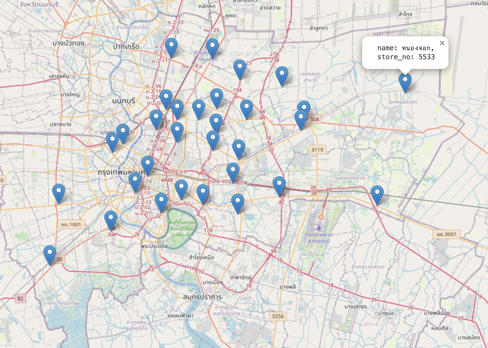

# transport-routes-planning



- location table 1. [Map](webapp/locations.html) 2. [Table](webapp/location_table.html)
  - plot nodes (location marker) on a map with GeoJSON/Leaflet
  - produce GeoJSON for plotting
- distance matrix
- TODO: calculate linehaul for 30 locations and put in DistanceMatrix


```
npm run test
npm run start  # starts app at http://127.0.0.1:8080
```


```
pytest --junit-xml=test_report.xml
```

### locations

python3 cli.py locations --files=../data/locations.json

### run

python3 cli.py run


# GIS Service

* geoserver
* postgresql/postgis
* mongodb

```
cd gis-service  
docker-compose up
```